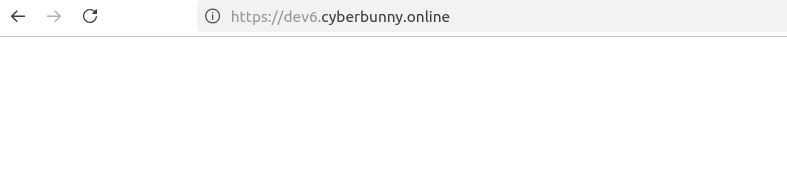
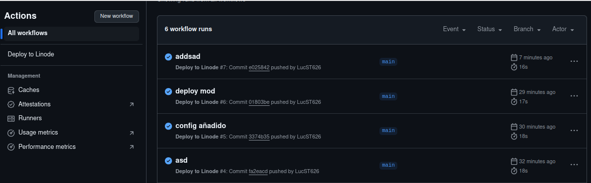

# Examen 2º Trimestre

## Despliegue HTTPS
1. Para el despliegue de nuestro servidor debemos crear un index.js con la configuración necesaria:
```js
app.get('/', (req, res) => {
  res.send('Server Lucas');
})


console.log(process.env.NODE_ENV);
if(process.env.NODE_ENV === 'production'){

  const options = {
    key: fs.readFileSync(path.join(__dirname, 'privkey.pem')),
    cert: fs.readFileSync(path.join(__dirname, 'fullchain.pem'))
  };

  // Crear el servidor HTTPS
  https.createServer(options, app).listen(port, () => {
    console.log(`Server started on https://dev1.cyberbunny.online:${port}`);
  });
  
}else{

  // Crear el servidor HTTP
  http.createServer(app).listen(port, () => {
    console.log(`Server started on http://localhost:${port} o http://yourIP:${port}`);
  });
}
```

2. Configuramos nuestro .env dependiendo si lo queremos en "production" que se despliega con https o no configurandolo que automáticamente se nos desplegará en http.

3. Luego accederemos a nuestro servidor desde la consola.
```bash
ssh root@ip
```

4. Siguiendo de esto, ejecturemos el ./deploy.sh de la siguiente manera:
```bash
chmod +x deploy.sh
./deploy.sh
```

5. Comprobamos los certificados de https.

6. Verificamos que arranca.



7. Instalamos y ejecutamos PM2
Seguir comentando

## Deploy CI/CD
1. Crear un repositorio en GitHub
2. Crear una carpeta llamada `.github/workflows`

    2.1. Dentro de la carpeta crear un archivo llamado deploy.yml:

```yaml
#!/bin/bash

echo "Conectando al servidor remoto..."

# Actualizar los paquetes del sistema
apt update

# Instalar npm, nodejs y certbot
apt install -y npm nodejs certbot

# Instalar dependencias del proyecto
npm install

# Generar certificados SSL usando certbot
certbot certonly --standalone -d dev6.cyberbunny.online --non-interactive --agree-tos -m lucasst626@gmail.com

# Verificar si los certificados fueron generados correctamente
if [ -f /etc/letsencrypt/live/dev6.cyberbunny.online/fullchain.pem ] && [ -f /etc/letsencrypt/live/dev6.cyberbunny.online/privkey.pem ]; then
  # Crear directorio de certificados si no existe
  mkdir -p ./certs

  # Copiar los certificados generados a la ubicación esperada por tu aplicación
  cp /etc/letsencrypt/live/dev6.cyberbunny.online/fullchain.pem/certs/fullchain.pem
  cp /etc/letsencrypt/live/dev6.cyberbunny.online/privkey.pem/certs/privkey.pem

  # Cambiar permisos de los archivos de certificados
  chmod 600 ./certs/fullchain.pem
  chmod 600 ./certs/privkey.pem

  echo "Certificados copiados y permisos establecidos."
else
  echo "Error: Certificados no generados correctamente."
  exit 1
fi

# Detener el proceso existente de PM2 si existe
pm2 stop proyecto-final || true

# Iniciar el proceso con PM2 utilizando el archivo ecosystem.config.js
pm2 start ecosystem.config.js --env production

# Guardar la lista de procesos de PM2
pm2 save

echo "Despliegue completado."
```

3. Subir el flujo de trabajo
```bash
git add .
git commit -m "Agregar flujo de trabajo CI"
git push 
```

4. Añadir secretos en GitHub
    1. Accede a tu repositorio en GitHub.

    2. En la barra de menú de tu repositorio, haz clic en Settings (Configuración).

    3. En el menú de la izquierda, desplázate hacia abajo hasta encontrar la sección Secrets.

    4. Haz clic en Secrets y luego selecciona New repository secret.
        - Aquí agregarás los secretos que usas en tu archivo YAML, como las credenciales SSH (SSH_HOST, SSH_USER, SSH_PASSWORD, etc.).

5. Verificar que todo este correcto



Prueba de CI/CD

He tenido problemas de todo tipo en la consola, no hay CI/CD